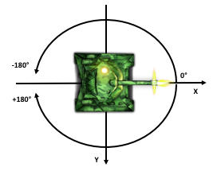

# Battle Anatomy

## Coordinate System

X coordinates of the battle field increase from left to right. Y coordinates increase from top to down. Top right corner of the battle field is not necessarily at (0, 0) and may be randomly shifted. Radar of the tank should be used to detect wall instead of assuming any constant coordinates.

All angles are in a range between -180° and 180°. Angle 0° is equivalent to left direction (east).

## Simulation Mechanics

Simulation processing loop updates all objects in the battlefield (tanks and bullets). In every step of the loop [AI Script](ai_script.md) is being called and returned information is used to control the behavior of tanks.

## Battle Duration and Speed

Standard battle takes 30 seconds when watching at normal speed. The duration will be extended if there are more than two tanks in the battle. Extra 2 seconds are added for every additional tank. The speed of the simulation can be increased or decreased. In such case, the frequency of simulation processing loop will change.

## Graphic's Quality

JsBattle try to adjust the optimal level of graphic quality to make sure that the simulation can go with defined speed. If performance issues occur and quality level is set to **Auto**, some graphical effects and refresh rate may be reduced. It is also possible to select quality level manually (**Low**, **Medium** or **High**). For the lowest level, Debug view and Score Board will not be displayed.
