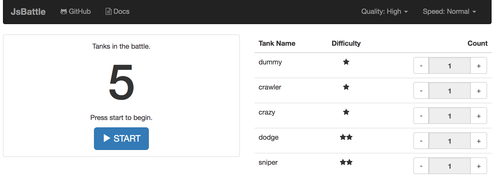
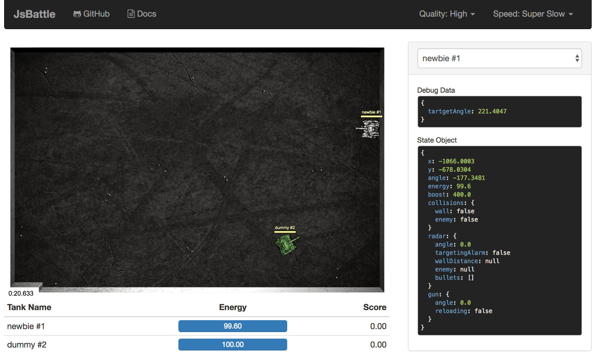
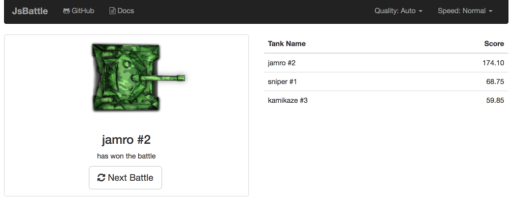

# Getting Started

If you are interested in running JsBattle locally, please read the [Installation](installation.md) section.

## Starting the Battle

When you open JsBattle you will see Battle configuration screen.



You choose tanks for a battle there. It is also possible to choose several tanks of the same time. The game comes with bundled set of enemies so you can test it even before you write the first tank algorithm. Skip the configuration for now and just click **Start** button to begin the first battle:



Tank chosen in the previous step will start to fight. Below the battlefield, there is a ranking board with actual score and energy of each tank. There is also a debug view on the right, but let's leave it now. We will get back to it later.

Speed and the quality of the battle can be adjusted by controls located at the right-top corner of the screen. Higher speeds may result in a lower graphical quality of battle simulation (if Quality is set to **Auto**). **JsBattle** will adjust the quality of graphics to keep a proper speed of the simulation and finish it in time.

The battle is time limited. It is finished when time runs out or there is only one tank left on the battlefield.

After the battle, a short summary will be show:



Let's click **"Next Battle"** and build your first tank program.

## Creating Tank Script

Click **"Create Tank"** button to add new tank to the list. It will appear on the top with a random name


Choose only two tanks for the battle: your new tank and `dummy`. Set count for all other tanks to zero. It will be easier to test your tank with one enemy only. Now click the edit button next to your new tank to open **AI Script Editor**:


You can change the name of your tank here by clicking the edit button next to its name.

Below, there is an [Artificial Intelligence Script](ai_script.md) of your tank. It is just filled by a standard template. Let's take a look at it a little bit deeper.

## Code Artificial Intelligence

```javascript
  importScripts('lib/tank.js');

  tank.init(function(settings) {

  });

  tank.loop(function(state, control) {

  });
```

The first line imports tank library that will be required to implement tank steering algorithm.

Callback passed to `init` function is called at the beginning of the battle and allows you to setup your tank. `loop` is called on every step of simulation processing loop and this is the place where you will put the logic of your tank.

Let's make a simple modification and add one line to `loop` callback:

```javascript
  tank.loop(function(state, control) {
    control.THROTTLE = 1;
  });
```

This implementation of the script will cause the tank to move forward at full speed by modification of its [control object](tank_control_object.md).

Click **Quick Battle** to immediately test your tank. (Setup from the previous step will be used, so `dummy will be your opponent`)  

There should be nothing exciting yet. Your tank will probably hit the wall and destroy itself in this way :) Feel free to click **Exit** if you don't want to watch this drama :)

### Movement

Let's modify the script because our tank needs more intelligence there. The tank must avoid obstacles and search for an enemy

```javascript
importScripts('lib/tank.js');

var tartgetAngle;

tank.init(function(settings) {
  tartgetAngle = 0;
});

tank.loop(function(state, control) {

  // turn tank in target direction
  var angleDifference = Math.deg.normalize(tartgetAngle - state.angle);
  control.TURN = angleDifference*0.2;

  // move forward if pointed to correct direction
  if(Math.abs(angleDifference) < 5) {
    control.THROTTLE = 1;
  } else {
    control.THROTTLE = 0;
  }

  // change direction when hit the wall
  if(state.collisions.wall) {
    tartgetAngle += Math.randomRange(45, 180);
    control.THROTTLE = 0;
  }

  control.DEBUG = {
    tartgetAngle: tartgetAngle
  }

});
```

`targetAngle` is a desired rotation of the tank. It will be changed randomly on every wall hit. At the beginning `targetAngle=0` so the tank will start from moving to the east. Following two lines of code turn the tank to the desired direction:

```javascript
var angleDifference = Math.deg.normalize(tartgetAngle - state.angle);
control.TURN = angleDifference*0.2;
```

`Math.deg.normalize` allows normalizing the angle so it is always between -180 and 180 degrees. If the difference between current and desired angle is positive, `control.TURN` will be set to a positive value and start moving clockwise. Otherwise, the rotation will be counter clockwise. If the difference between angles drops down, then `control.TURN` will be reduced too and thus speed of rotation will decrease.

```javascript
if(Math.abs(angleDifference) < 5)
```

This condition ensures that tank is moving forward only when the difference between current and desired angle is smaller than 5 degrees.

Information about collisions with walls is stored in [tank state object](tank_state_object.md) at `state.collisions.wall`. Whenever this value is `true`,the desired direction of the tank should be changed randomly. It is important to stop the tank at this point so it does not hit the wall again and does not receive additional damage.

```javascript
if(state.collisions.wall) {
  tartgetAngle += Math.randomRange(45, 180);
  control.THROTTLE = 0;
}
```

`Math.randomRange` is another extension of `Math` object that is available in AI scripts and it returns a random number from  specified range. See **Extended Math Object** section in [AI Script](ai_script.md) documentation for more details.

At the end of the script, there is some debug logging

```javascript
control.DEBUG = {
  tartgetAngle: tartgetAngle
}
```

You can observe how the debug object is changing over the battle by selecting your tank from **Debug View** from **Battle Screen**.

Now start the battle again by clicking **Quick Battle** and watch the new version of your AI in action.


If you are lucky, you could even earn some points because ramming is part of [scoring system](scoring_system.md). Take a look also at the **Debug View**. It will show `control.DEBUG` but the [state object](tank_state_object.md)

### Aiming and shooting

Now, we need to add logic that allows to aim and shoot the target. Add following code at the end of your `loop` callback:

```javascript
tank.loop(function(state, control) {

  // ...

  // keep turning the radar
  control.RADAR_TURN = 1;
  if(state.radar.enemy) {
    control.THROTTLE = 0;
    control.TURN = 0;
    control.RADAR_TURN = 0;

    // calculate desired angle of the gun
    // so it will be pointed to the enemy
    var targetAngle = Math.deg.atan2(
      state.radar.enemy.y - state.y,
      state.radar.enemy.x - state.x
    );

    // turn the gun
    var gunAngleDifference = Math.deg.normalize(targetAngle - state.angle - state.gun.angle);
    control.GUN_TURN = gunAngleDifference*0.2;

    // keep shooting
    control.SHOOT = 1;
  }
});
```
Setting `control.RADAR_TURN=1` will keep the radar constantly rotating clockwise.

When an enemy is spotted, field `state.radar.enemy` will contains information about it. In such case radar and the tank should be stopped what can be done by overriding previous values of [control object](tank_control_object.md):

```javascript
control.THROTTLE = 0;
control.TURN = 0;
control.RADAR_TURN = 0;
```

After that, there is a small trigonometry magic with arcus tangent function used to the determine desired angle of the gun.

```javascript
var targetAngle = Math.deg.atan2(
  state.radar.enemy.y - state.y,
  state.radar.enemy.x - state.x
);
```

When we know where the gun should be pointed, the only thing that has left is to rotate it and shoot:

```javascript
var gunAngleDifference = Math.deg.normalize(targetAngle - state.angle - state.gun.angle);
control.GUN_TURN = gunAngleDifference * 0.2;
control.SHOOT = 1;
```

Notice that to calculate `gunAngleDifference`, it is required to take into account both: angle of the tank and angle of the gun. The reason is that `state.gun.angle` is relative to tank rotation. It is described in more details in [Battle Anatomy](battle_anatomy.md).

That's all. Start the battle and watch your victory.

## What's next?

Try to modify your AI script and test is against [more powerful opponents](bundled_tanks.md).

Learn more about **JsBattle** mechanics by reading the manual:

- [Battle Anatomy](battle_anatomy.md)
- [Tank Anatomy](tank_anatomy.md)
- [AI Script](ai_script.md)
- [Scoring System](scoring_system.md)
- [Constants and Formulas](consts.md)
