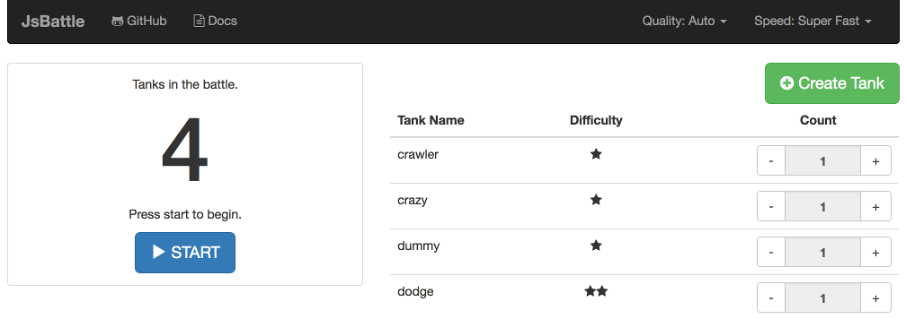

# Installation


## Option 1: Download from GitHub

Download sources of the latest release from here: [https://github.com/jamro/jsbattle/releases](https://github.com/jamro/jsbattle/releases) and unpack the archive.

Go to the directory with the game and install all NPM dependencies:

```bash
  npm install
```

## Option 2: Use NPM

Install JsBattle in selected directory:

```bash
  npm install jsbattle
```

Go to `node_modules/jsbattle` directory

## Run the game

Start web server that is required to run JsBattle simulator:

```bash
  npm start
```

The command will output URL of the server:

```
  Starting up http-server, serving ./
  Available on:
    http://127.0.0.1:8080
  Hit CTRL-C to stop the server
```

Open your favorite web browser and navigate to URL from the previous step

```
  http://127.0.0.1:8080
```

It will open battle starting page



Just click the **Start** button to watch the battle.
