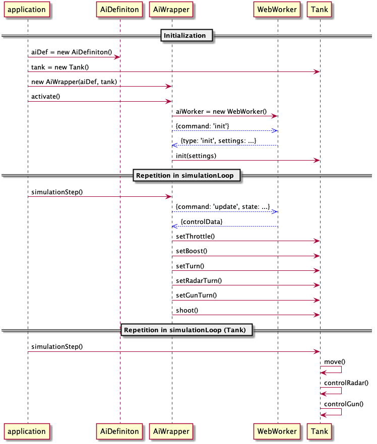

# Artificial Intelligence

`AIWrapper` is created according to setup of `AiDefinition`. Most common case
is running of AI script within isolated Web Worker:

(Blue arrows represent messages between WebWorker and the main application)

After each `AiWrapper.simulationStep()`, control data is sent to the `Tank`
but is not processed yet. Changes of tank's state is made during
`Tank.simulationStep()` call.
