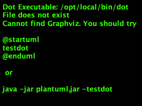

# Infrastructure

The most straightforward possible deployment is a single server process that can be connected via a web browser. There are no proxies, no databases, no horizontal scaling. You get such setup with the default configuration.

# Advanced example
Here is more advanced deployment that is more suitable for production usage.

## Web Proxy
A web server (e.g. **Nginx**)  could be used to improve performance and security of web calls. Use of SSL is recommended to encrypt requests to the API that may contain sensitive data (e.g. JWT tokens). To improve delivery of the static content, everything except `/api/*` could be cached. Web proxy could also be used to bind port of the service to `80`.

## Database
The default configuration uses in-memory storage that will not be suitable for production purposes. There are a couple of DB Adapters possible. See [configuration](../../configuration.md) section for more details. MongoDB is recommended. The DB schema will be created automatically after the startup of the server.

## Scaling out
When more computing power is needed, multiple worker processes could be launched. They will run micro-services that could be scaled out. All nodes will communicate with each other. There are multiple transporters supported. TCP or MQTT are recommended. See [configuration](../../configuration.md) section for more details.
