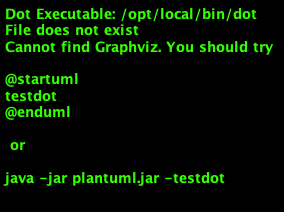

# JsBattle Server

## Overview

Server architecture is based on micro-services powered by [SenecaJS](http://senecajs.org) engine.

### API service

All internal services are exposed via API service (that is actually also one of
SenecaJS services). The API service does not host any business logic however,
it may include some routing and validation functionality.

## Gateway

The API is accessible through the Gateway, which is responsible for:
- controlling HTTP interface
- mapping HTTP calls to API services calls
- hosting static content
