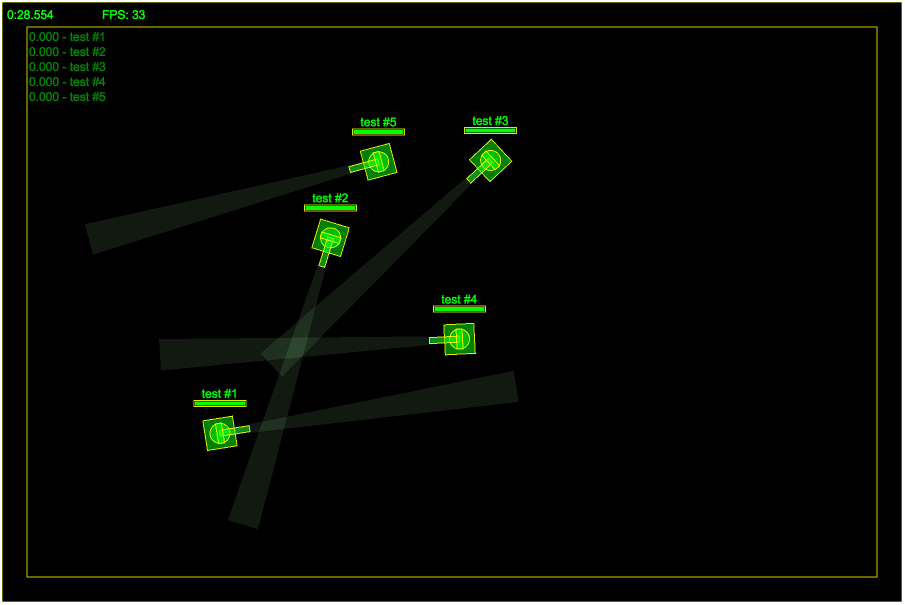

# JsBattle Library

You can use battle simulation library as an external dependency in your project without launching the whole game. It could be a convenient way in running the battle in your own application.

## Setup your project

At the beginning create initial structure of your project with empty folders:

```
|-- JsBattleTutorial
    |-- js
    |-- tanks
        |--lib
```
You will need two files from JsBattle projects. Download them and put into your project structure:

 - `/dist/public/js/jsbattle.min.js` should saved in `/js/jsbattle.min.js`
 - `/dist/public/tanks/lib/tank.js` should saved in `/tanks/lib/tank.js`

`jsbattle.min.js` contains core modules of battle simulation. `tank.js` includes helper modules for Web Workers where the code of tanks AI will run.

After that, Install `http-server`, we will need it later to serve website with the battle:

```bash
npm install -g http-server
```

Next, create a simple [AI Script](../manual/ai_script.md) and save it at `/tanks/test.task.js`

```javascript
importScripts('lib/tank.js');

tank.init(function(settings, info) {

})
tank.loop(function(state, control) {
  control.THROTTLE = 0.5;
  control.TURN = 1;
});
```

It does not do much. Just turning around but it should be enough for our test.

Create `/index.html` in project root directory and fill it with following content:

```html
<!DOCTYPE html>
<html lang="en">
  <head>
    <meta charset="utf-8">
    <title>JsBattle Tutorial</title>
    <script type="text/javascript" src="js/jsbattle.min.js"></script>
  </head>
  <body>
    <canvas id="battlefield" style="width: 900px; height: 600px"></canvas>
    <script type="text/javascript">
      // put your code here...
    </script>
  </body>
</html>
```

This is just a basic template of an HTML page. It contains `canvas` tag where the battle will be rendered and
`script` tag where we will put our code.

You should have following files structure after this step:

```
|-- JsBattleTutorial
    |-- js
    |   |-- jsbattle.min.js
    |-- tanks
    |   |--lib
    |   |  |-- tank.js
    |   |-- test.tank.js
    |-- index.html
```

## Initialize battle simulation

Let's write some code:

```html
<script type="text/javascript">
  var canvas = document.getElementById('battlefield');
  var renderer = JsBattle.createRenderer('debug');
  renderer.init(canvas);

  var simulation = JsBattle.createSimulation(renderer);
  simulation.init(900, 600);
  for(var i=0; i < 5; i++) {
    var ai = JsBattle.createAiDefinition();
    ai.fromFile('test');
    simulation.addTank(ai);
  }
  simulation.start();
</script>
```

First lines create a renderer, attach it to a canvas and initialize it. It this example we will use `debug` renderer which is the simplest implementation of a renderer. `JsBattle` is defined in `jsbattle.min.js` and is used to initialize objects required for the simulation.

```javascript
  var canvas = document.getElementById('battlefield');
  var renderer = JsBattle.createRenderer('debug');
  renderer.init(canvas);
```

The renderer created above can be now used to create simulation object and initialize it. It is possible to change dimensions of the battlefield by passing different values to `simulation.init(width, height)`. Remember to update style setting of `canvas` tag so its dimensions match the size of the battlefield.

```javascript
  var simulation = JsBattle.createSimulation(renderer);
  simulation.init(900, 600);
```

When the simulation is ready, we can add tanks to the battle. Remember to add at least two. Otherwise, the battle will finish immediately since there will be no opponents left and the only one tank will be recognized as the winner:

```javascript
var ai = JsBattle.createAiDefinition();
ai.fromFile('test');
simulation.addTank(ai);
```

`tankName` argument passed to `AiDefinition.fromFile()` must correspond to the filename of tank's AI. In this case, setting it to `'test'` will result in downloading AI Script from `/tanks/test.tank.js`.

When all tanks are added it is time to begin the battle:

```javascript
  simulation.start();
```

Start `http-server` and open the game in your web browser `http://127.0.0.1:8080`:

```bash
http-server -c-1
```

You should see something like that:


## AiDefinition Internals

So far we have seen a very basic example of `AiDefinition` usage however, there are more advanced features that could be useful. In previous example, AI script was created from a file:

```javascript
var ai = JsBattle.createAiDefinition();
ai.fromFile('my-tank');
```
However, you can also create it from a string that contains code to be executed:

```javascript
var ai = JsBattle.createAiDefinition();
var code = "tank.init(function(settings, info) { console.log('Hello World!') })";
ai.fromCode('my-tank', code);
```

It is also possible to pass some data to AI script through `AiDefinition`:

```javascript
var customData = {foo: "bar"};
ai.fromCode('my-tank', code, customData);

// works also for AI created from file
ai.fromFile('my-tank', customData);
```

`customData` object will be available in your AI script in `settings` object passed through `init` callback:

```javascript
// AI Script ----------------------------------------
tank.init(function(settings, info) {
  var customData = info.initData;
  console.log(customData); // will print {foo: "bar"}
})
```

## Speeding up Battle Simulation

Let's say that you would like to simulate battles in ultra short time. Some use cases of such approach could be gathering of statistics or genetic programming. The first thing that you probably do is to set speed multiplier to a very high value:

```javascript
simulation.setSpeed(1000);
```

However, this could be not enough. If you want simulate battles even faster, disable rendering. It can be done by not passing a reference of a renderer to the constructor of `Simulation`:

```javascript
var simulation = JsBattle.createSimulation();
```

Another thing that you could consider is to disable sandboxing of AI scripts (available for script created from code by `AiDefinition.fromCode`). This could be potentially dangerous because it gives AI access to the internals of JsBattle so do it only for trusted AI scripts:

```javascript
ai.disableSandbox();
```

It will give you also a possibility to run several battles in parallel without losing the performance. If multiples battles run at the same time, sometimes, there could be some lags in AI responses. It will result in a warning, and if the problem repeats, the battle can be eventually stopped. To avoid such issues, increase AI script execution limit:

```javascript
ai.executionLimit = 1000;
```

Here is a full script that runs several, concurrent battles in ultra speed:

```javascript
function startBattle() {
  var startTime;
  var simulation = JsBattle.createSimulation();
  simulation.init(900, 600);
  for(var i=0; i < 5; i++) {
    var ai = JsBattle.createAiDefinition();
    var code = "tank.init(function(s) { console.log('Ready!') })";
    ai.fromCode('empty', code);
    ai.disableSandbox();
    ai.executionLimit = 1000;
    simulation.addTank(ai);
  }
  simulation.setSpeed(1000);
  simulation.onStart(() => {
    startTime = (new Date()).getTime();
  });
  simulation.onFinish(() => {
    var stopTime = (new Date()).getTime();
    var duration = stopTime - startTime;
    console.log("Battle duration: " + duration + "ms")
    startBattle();
  });
  simulation.start();
}
startBattle();
startBattle();
```
