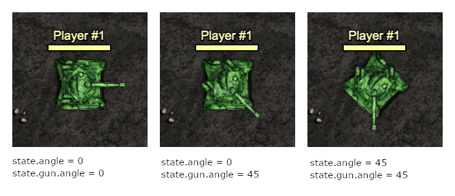
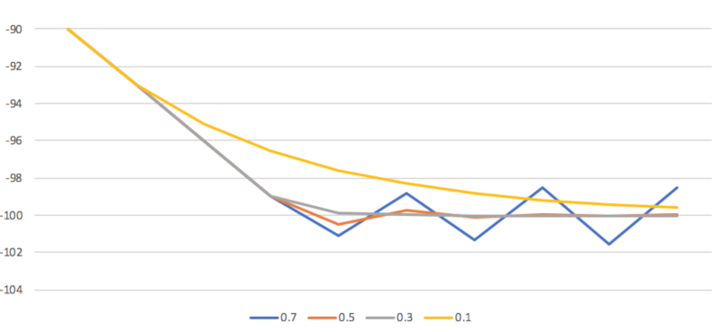

# Algorithms: Aiming

## Consider rotation of the tank
Remember that the angle of the gun is relative to the body of the tank:



During aiming, you should take into account the rotation of the tank body. If you want to  point the gun to the south (`90°`) following formula should be applied to do it despite rotation of the tank body:
```
  let gunAngle = Math.deg.normalize(90 - state.angle);
```
The same rule applies to the radar. Its rotation is also relative to the body (**not to the gun!!!**). If you want to point it to the south, you must consider the rotation of the tank:
```
  let radarAngle = Math.deg.normalize(90 - state.angle);
```

## Aim at the target angle

Once you know the angle where the tank should point its gun, we need to write a proper algorithm in `tank.loop(...)` to start to move it in the proper direction and stop when it is on the target. Two examples are shown here. In both cases, we will be pointing the gun at the north (`targetAngle = -90`).

### Varian A: Longer code

```javascript
let targetAngle = -90;
let gunAngle = Math.deg.normalize(targetAngle - state.angle);
let angleDiff = Math.deg.normalize(gunAngle - state.gun.angle);

if(angleDiff > 1) {
  control.GUN_TURN = 1;
} else if(angleDiff < -1) {
  control.GUN_TURN = -1;
} else {
  control.GUN_TURN = 0;
}
```

**How does it work?**
First three lines are quite simple and you have seen similar examples previously:
1. define the target angle where you want to aim
2. calculate the angle of gun taking into account rotation of tank body. [Normalize](./algorithms_geometry.md) the angle so the value is between -180° and 180°
3. calculate the difference between the current angle of the gun and desired rotation (also [normalize](./algorithms_geometry.md) it at the end)

Depending on the difference between target and current target we want to take a different action (please notice that after normalization it will be always between -180° and 180°):
- if `angleDiff` is more then 1° turn the gun clockwise
- if `angleDiff` is less then -1° turn the gun counterclockwise
- if `angleDiff` is between -1° and 1° stop the gun since you are close enough

Why do intentionally make the aiming less accurate by introducing the margin between -1° and 1°? Let's assume that we do not have the margin at all. The code will look like that:
```javascript
if(angleDiff > 0) {
  control.GUN_TURN = 1;
} else if(angleDiff < 0) {
  control.GUN_TURN = -1;
} else {
  control.GUN_TURN = 0;
}
```
...and now let's simulate what will happen in each simulation step. Following values will not change:
- `state.angle = 10`: let's assume any rotation of the tank, it does not matter
- `targetAngle = -90`: this is our target at the north
- `gunAngle = -100`: it is constant since it result of `targetAngle - state.angle` (-90 - 10 = -100)
- turning speed of the gun is `3`. See more in [Constants and Formulas](./consts.md)

Simulation step  |    1 |    2 |    3 |    4 |    5 |    6 |    7 |    8 |    9 |   10 |
-----------------|------|------|------|------|------|------|------|------|------|------|
state.gun.angle  |  -90 |  -93 |  -96 |  -99 | -102 |  -99 | -102 |  -99 | -102 |  -99 |
angleDiff        |  -10 |   -7 |   -4 |   -1 |    2 |   -1 |    2 |   -1 |    2 |   -1 |
control.GUN_TURN |   -1 |   -1 |   -1 |   -1 |    1 |   -1 |    1 |   -1 |    1 |   -1 |

As you can see, without the margin, the gun will jitter between -99° and -102°, never reaching target value of `gunAngle = -100`. The reason is that the movement is discrete and in each simulation step the gun is turned at maximum speed of 3°. The margin make the movement stable:

Simulation step  |    1 |    2 |    3 |    4 |    5 |    6 |    7 |    8 |    9 |   10 |
-----------------|------|------|------|------|------|------|------|------|------|------|
state.gun.angle  |  -90 |  -93 |  -96 |  -99 |  -99 |  -99 |  -99 |  -99 |  -99 |  -99 |
angleDiff        |  -10 |   -7 |   -4 |   -1 |   -1 |   -1 |   -1 |   -1 |   -1 |   -1 |
control.GUN_TURN |   -1 |   -1 |   -1 |    0 |    0 |    0 |    0 |    0 |    0 |    0 |

In this example aiming is still inaccurate since there is 1° of error, however, it should be acceptable in most cases. A more accurate variant is shown below.

### Varian B: Shorter code

```javascript
let targetAngle = -90;
let gunAngle = Math.deg.normalize(targetAngle - state.angle);
let angleDiff = Math.deg.normalize(gunAngle - state.gun.angle);

control.GUN_TURN = 0.3 * angleDiff;
```

Beginning of this example is the same as in the previous one. The difference in in the last line. When analyzing this example,  keep in mind that the actual value of `control.GUN_TURN` is always capped to be between -1 and 1 (so the maximum gun rotation speed is always `3`):

Simulation step    |    1 |    2 |    3 |    4 |    5 |    6 |     7 |    8  |     9 |    10 |
-------------------|------|------|------|------|------|------|-------|-------|-------|-------|
Gun rotation speed |  0.00| -3.00| -3.00| -3.00| -0.90| -0.09|  -0.01|   0.00|   0.00|   0.00|
state.gun.angle    |-90.00|-93.00|-96.00|-99.00|-99.90|-99.99|-100.00|-100.00|-100.00|-100.00|
angleDiff          |-10.00| -7.00| -4.00| -1.00| -0.10| -0.01|   0.00|   0.00|   0.00|   0.00|
control.GUN_TURN   | -3.00| -2.10| -1.20| -0.30| -0.03|  0.00|   0.00|   0.00|   0.00|   0.00|

This algorithm will slow down when it is closer to the target value stopping eventually. Where `0.3` factor comes from? It was adjusted experimentally. In general, using higher values will result in an unstable movement. A too low value will make the gun reach target rotation slower. Here are a few examples:



## Aim at target coordinates

Usually, the data that you have are `x` and `y` coordinates, not the angle where you want to aim. In such case all the process needs to be split into a few steps:

1. Calculate the angle using the arctangents function. See details [here](./algorithms_geometry.md)
2. Calculate the angle of the gun taking into account rotation of your tank body (as described above)
3. Aim the gun at your target (as described above)

You can also try to improve the accuracy by predicting the position of the target in future if it is moving.

## Use the radar

An important aspect of aiming at moving target is keeping it in range of radar so you have up-to-date information about its position. It could be split into a few issues:

- locate any enemy
- follow the enemy by radar
- keep a proper distance to the enemy

### Locate any enemy
The easiest way is to keep your radar rotating until you spot an enemy:

```javascript
if(!state.radar.enemy) {
  control.RADAR_TURN = 1;
} else {
  // you've got him!
  control.RADAR_TURN = 0;
}
```

### Follow the target by radar
When your radar spot an enemy, `state.radar.enemy` will contain all its, data including the coordinates (see [Tank State Object](./tank_state_object.md) for more details). Detected target may be located somewhere at the edge of the radar beam. To avoid losing it soon, you need to keep the target in the centre of the beam. In can be achieved in a few steps:

1. Calculate the angle where the radar must be aimed to, using arctangents function. See details [here](./algorithms_geometry.md)
2. Calculate the angle of the radar taking into account rotation of your tank body (as described above for gun rotation)
3. Point the radar at your target (as described above for gun rotation)

```javascript
  let targetAngle = Math.deg.atan2(state.radar.enemy.y - state.y, state.radar.enemy.x - state.x);
  let radarAngle = Math.deg.normalize(targetAngle - state.angle)
  let radarAngleDiff = Math.deg.normalize(radarAngle - state.radar.angle);
  control.RADAR_TURN = 0.3 * radarAngleDiff;
```


### Keep the proper distance to the target
To control the distance, you must turn your tank to the direction of the target. In this way, you can easily be farther or closer by going back and forth. It is quite similar to pointing the gun or radar to the target, but this time we will be moving the whole tank:

```javascript
  let targetAngle = Math.deg.atan2(state.radar.enemy.y - state.y, state.radar.enemy.x - state.x);
  let bodyAngleDiff = Math.deg.normalize(targetAngle - state.angle);
  control.TURN = 0.5 * bodyAngleDiff;
```
Notice that it should not impact any of code that rotates gun or radar since in all of those cases calculations consider rotation of tank's body (`state.angle`).

Radar beam has a range of `300` (you can check it in [Constants and Formulas Section](./consts.md) ). Let's assume that a safe distance that avoids losing the target is half of that,  so `150`. The following code will ensure that the tank tries to keep that distance

```javascript
  let targetDistance = Math.distance(state.x, state.y, state.radar.enemy.x, state.radar.enemy.y);
  let distanceDiff = targetDistance - 150;
  control.THROTTLE = distanceDiff/100;
```

### Put everything together

At the end the code should look like this:

```javascript
if(!state.radar.enemy) {
  control.RADAR_TURN = 1;
} else {
  control.RADAR_TURN = 0;

  let targetAngle = Math.deg.atan2(state.radar.enemy.y - state.y, state.radar.enemy.x - state.x);
  let radarAngle = Math.deg.normalize(targetAngle - state.angle)
  let radarAngleDiff = Math.deg.normalize(radarAngle - state.radar.angle);
  control.RADAR_TURN = 0.3 * radarAngleDiff;

  let bodyAngleDiff = Math.deg.normalize(targetAngle - state.angle);
  control.TURN = 0.5 * bodyAngleDiff;

  let targetDistance = Math.distance(state.x, state.y, state.radar.enemy.x, state.radar.enemy.y);
  let distanceDiff = targetDistance - 150;
  control.THROTTLE = distanceDiff/100;

  let gunAngle = Math.deg.normalize(targetAngle - state.angle);
  let gunAngleDiff = Math.deg.normalize(gunAngle - state.gun.angle);

  control.GUN_TURN = 0.3 * gunAngleDiff;
}
```
